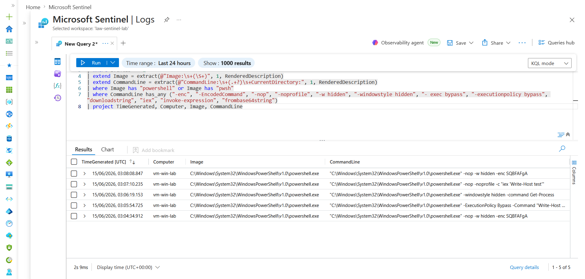
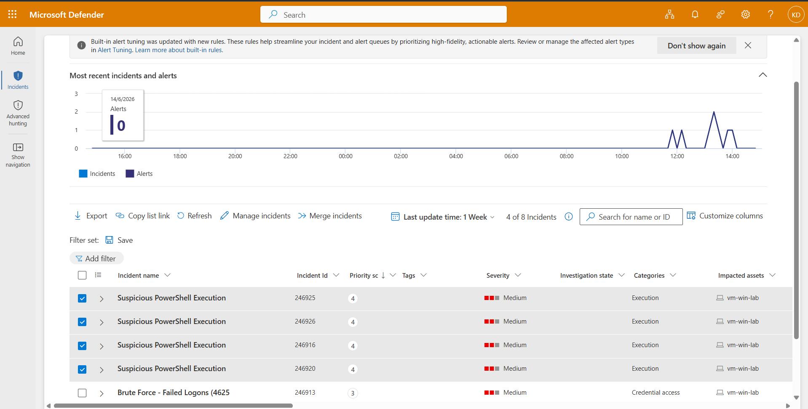

# Detection 2 — Suspicious PowerShell Execution

**MITRE ATT&CK:** [T1059.001 — PowerShell](https://attack.mitre.org/techniques/T1059/001/), [T1027 — Obfuscated Files or Information](https://attack.mitre.org/techniques/T1027/)
**Tactic:** Execution / Defense Evasion
**Data source:** Sysmon (Event ID 1 — process creation)
**Severity:** Medium

## The threat

Attackers frequently launch PowerShell with flags that legitimate users rarely combine: encoded commands (to hide intent), hidden windows (to run invisibly), execution-policy bypass (to skip safety controls), and download cradles (to pull and run remote code). Sysmon logs every process launch as **Event ID 1** with the full command line.

## The detection

```kql
Event
| where Source == "Microsoft-Windows-Sysmon"
| where EventID == 1
| extend Image = extract(@"Image:\s+(\S+)", 1, RenderedDescription)
| extend CommandLine = extract(@"CommandLine:\s+(.+?)\s+CurrentDirectory:", 1, RenderedDescription)
| where Image has "powershell" or Image has "pwsh"
| where CommandLine has_any ("-enc", "-EncodedCommand", "-nop", "-noprofile", "-w hidden", "-windowstyle hidden", "-exec bypass", "-executionpolicy bypass", "downloadstring", "iex", "invoke-expression", "frombase64string")
| project TimeGenerated, Computer, Image, CommandLine
```

**Logic:** filter to process-creation events → extract the image path and command line → keep PowerShell launches → flag any command line containing known attacker-favored strings.

## Validation

Ran benign-but-suspicious-looking PowerShell on the lab VM (harmless — these carry the *flags* attackers use but do nothing damaging):

```powershell
powershell.exe -nop -w hidden -enc SQBFAFgA
powershell.exe -ExecutionPolicy Bypass -Command "Write-Host hello"
powershell.exe -windowstyle hidden -command "Get-Process"
powershell.exe -nop -noprofile -c "iex 'Write-Host test'"
```

The detection returned all four launches with their command lines, correctly matched on the suspicious flags.

**Detection catching the suspicious PowerShell launches:**



**The scheduled rule raising incidents (Execution category):**



## Tuning notes / lessons

- **Signature detection vs. volume detection.** Unlike the brute-force rule (which needs a *threshold* because volume is the signal), this fires on a *single* match — a known-bad flag is itself the signal. No aggregation needed.
- **Generate test data first.** There was no malicious PowerShell in the logs to begin with, so the data had to be created before the detection could be validated. The process *launch* is the logged event, even if the command itself errors.

## Possible improvements / known false positives

- `-nop` and `-ExecutionPolicy Bypass` are *occasionally* used by legitimate admin scripts. Production tuning options: require 2+ suspicious flags together, or exclude known-good signed scripts by hash/path.
- Add parent-process context (e.g. flag PowerShell spawned by Office apps — a common macro-malware pattern).
