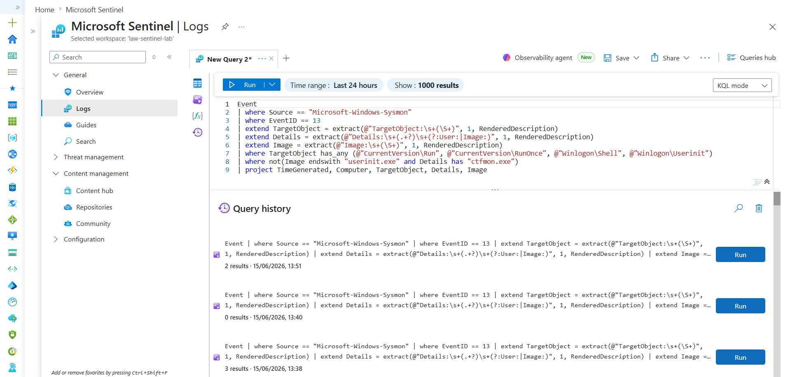
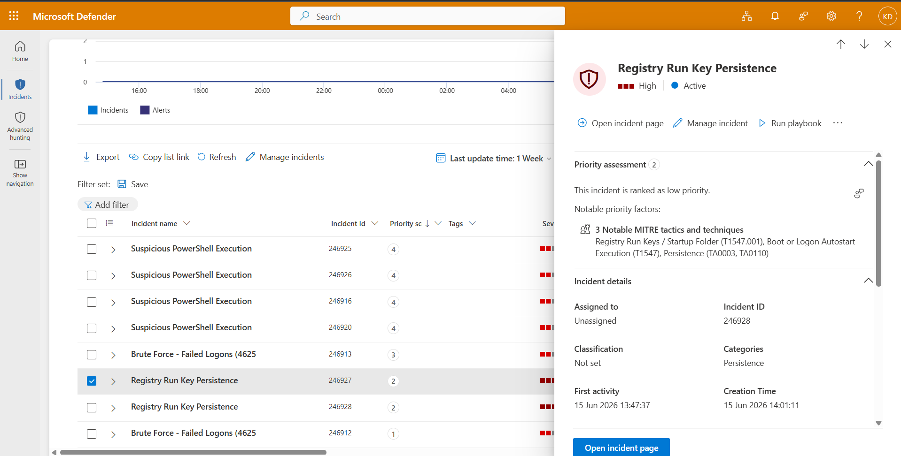

# Detection 3 — Registry Run-Key Persistence

**MITRE ATT&CK:** [T1547.001 — Registry Run Keys / Startup Folder](https://attack.mitre.org/techniques/T1547/001/)
**Tactic:** Persistence
**Data source:** Sysmon (Event ID 13 — registry value set)
**Severity:** High

## The threat

To survive reboots, malware commonly writes itself into a registry autostart location — `CurrentVersion\Run`, `RunOnce`, or Winlogon shell keys — so it launches automatically at every login. Sysmon logs registry modifications as **Event ID 13**.

## The detection (tuned)

```kql
Event
| where Source == "Microsoft-Windows-Sysmon"
| where EventID == 13
| extend TargetObject = extract(@"TargetObject:\s+(\S+)", 1, RenderedDescription)
| extend Details = extract(@"Details:\s+(.+?)\s+(?:User:|Image:)", 1, RenderedDescription)
| extend Image = extract(@"Image:\s+(\S+)", 1, RenderedDescription)
| where TargetObject has_any (@"CurrentVersion\Run", @"CurrentVersion\RunOnce", @"Winlogon\Shell", @"Winlogon\Userinit")
| where not(Image endswith "userinit.exe" and Details has "ctfmon.exe")
| project TimeGenerated, Computer, TargetObject, Details, Image
```

**Logic:** filter to registry-set events → extract the target key, the value written, and the writing process → flag writes to autostart locations → **exclude one specific known-good pattern** (see below).

## The false positive — and the tuning (the important part)

The naive version (without the final `where not(...)` line) fired immediately on **real, legitimate activity**: `userinit.exe` writing `ctfmon.exe` to a Run key. `ctfmon.exe` is the normal Windows text/input service, and Windows itself registers it to autostart. The rule wasn't *wrong* — it correctly matched "a write to an autostart location" — it was **too broad**.

This is the central problem in detection engineering: **a rule that fires on benign activity is worse than useless.** It trains analysts to dismiss the alert, so when a real attack trips the same rule, nobody looks (alert fatigue). Tuning out benign noise *is* the job.

The fix was a **narrow allowlist**:

```kql
| where not(Image endswith "userinit.exe" and Details has "ctfmon.exe")
```

This excludes only the *exact* benign combination (`userinit.exe` writing `ctfmon.exe`) rather than excluding `userinit.exe` wholesale. A broad exclusion would let an attacker abuse `userinit.exe` slip straight through — narrow exclusions preserve coverage.

## Validation (both sides)

A complete detection must catch the bad **and** ignore the good. Both were verified:

**True positive** — planted a fake persistence entry (harmless; the referenced file doesn't exist):

```powershell
New-ItemProperty -Path "HKLM:\Software\Microsoft\Windows\CurrentVersion\Run" -Name "FakeTestMalware" -Value "C:\temp\evil.exe" -PropertyType String -Force
```

→ Detection caught it.

**False positive** — the legitimate `ctfmon.exe` write → Detection correctly *did not* fire after tuning.

The scheduled rule raised a High-severity incident with an attack-story graph linking the affected host. Test entries were removed after validation.

**Tuned detection catching the planted persistence (and ignoring the benign ctfmon write):**



**The scheduled rule raising a High-severity incident, MITRE-mapped to T1547.001:**



## Possible improvements

- Tighten further by flagging only writes whose `Details` points to suspicious locations (user temp, AppData, unsigned binaries outside System32).
- Add startup-folder file creation (a parallel persistence technique) as a companion rule.
