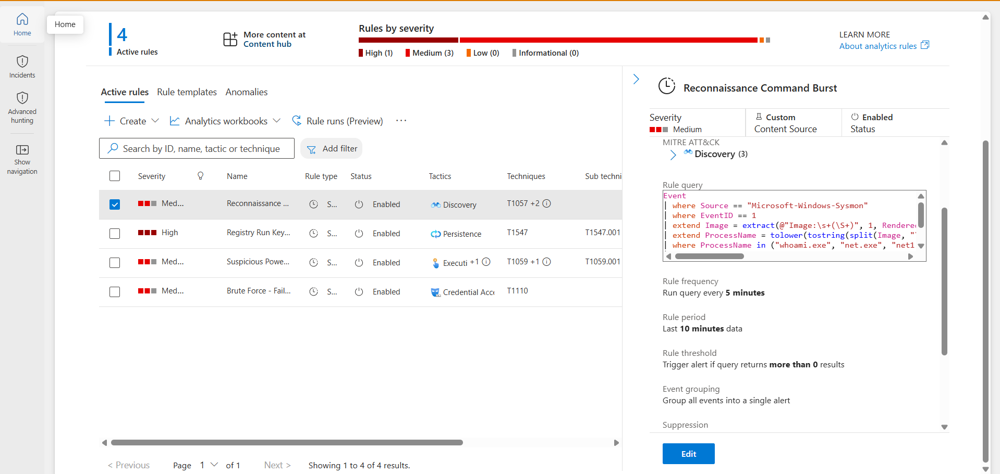
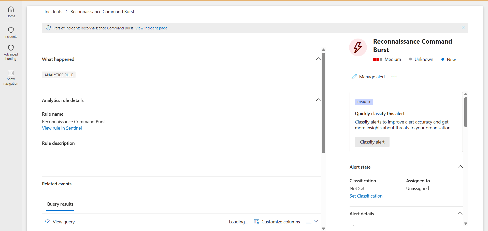

# Detection 4 — Reconnaissance Command Burst

**MITRE ATT&CK:** [T1057 — Process Discovery](https://attack.mitre.org/techniques/T1057/), [T1082 — System Information Discovery](https://attack.mitre.org/techniques/T1082/), [T1016 — System Network Configuration Discovery](https://attack.mitre.org/techniques/T1016/)
**Tactic:** Discovery
**Data source:** Sysmon (Event ID 1 — process creation)
**Severity:** Medium

## The threat

When an attacker first lands on a host, they orient themselves before doing damage — running a predictable cluster of built-in reconnaissance commands to learn who they are, what privileges they hold, and what's on the network: `whoami`, `net user`, `net group`, `nltest`, `systeminfo`, `ipconfig`, `tasklist`, `arp`, and similar.

The detection challenge here is different from the others in this lab. **No single one of these commands is malicious** — every one runs constantly during legitimate administration. The signal isn't any individual command; it's the *variety* — many different recon tools from one host in a short window. This is a behavioral detection, not a signature.

## The detection

```kql
Event
| where Source == "Microsoft-Windows-Sysmon"
| where EventID == 1
| extend Image = extract(@"Image:\s+(\S+)", 1, RenderedDescription)
| extend ProcessName = tolower(tostring(split(Image, "\\")[-1]))
| where ProcessName in ("whoami.exe", "net.exe", "net1.exe", "nltest.exe", "systeminfo.exe", "ipconfig.exe", "tasklist.exe", "hostname.exe", "nslookup.exe", "arp.exe", "route.exe")
| summarize ReconCommands = make_set(ProcessName), DistinctReconCount = dcount(ProcessName) by Computer, bin(TimeGenerated, 10m)
| where DistinctReconCount >= 5
| project TimeGenerated, Computer, DistinctReconCount, ReconCommands
```

**Logic:** filter to process creation → extract the executable name → keep only known recon tools → count *distinct* recon commands per host in 10-minute windows → flag any host running 5 or more different recon tools in that window.

The key line is `dcount(ProcessName)` — it counts *distinct* commands, not total. Ten runs of `whoami` alone isn't recon (distinct count = 1); `whoami` + `net` + `nltest` + `systeminfo` + `ipconfig` is (distinct count = 5). **The detection measures variety, not volume.**

## Validation

Ran a recon burst on the lab VM (all harmless — these commands only *read* system information):

```powershell
whoami
hostname
ipconfig /all
systeminfo
net user
net group
net localgroup administrators
tasklist
nltest /dclist:
arp -a
```

The detection returned a single row: `DistinctReconCount` of 9, with the full set of recon commands captured (`whoami`, `hostname`, `ipconfig`, `systeminfo`, `net`, `net1`, `tasklist`, `arp`, `nltest`). The scheduled rule raised an incident under the Discovery category.

**Detection firing on the recon burst (9 distinct recon commands clustered):**



**The scheduled rule raising an incident (Discovery category):**



## Tuning notes / lessons

- **Behavioral clustering vs. signature.** This is a third detection *pattern* in the lab. Detection 1 (brute force) is a volume threshold; detections 2 and 3 are signatures (a single known-bad match). This one detects a *pattern of variety* — closer to how modern behavioral detection works.
- **Case sensitivity bit hard.** Windows logs some process names uppercase (`ARP.EXE`) and others lowercase (`whoami.exe`). Without normalizing case, the `in` match silently dropped the uppercase entries, `dcount` under-counted, and the detection returned nothing even though the data was present. Fix: wrap the extraction in `tolower(...)`. This was the bug that made the detection appear broken when it wasn't.
- **Tuning direction is the opposite of Detection 3.** There, the fix was *narrowing* (excluding a benign pattern). Here, the false-positive risk is a sysadmin legitimately running several commands during troubleshooting — so the tuning lever is the *threshold* (raised from 4 to 5 distinct commands) rather than an exclusion. Different false-positive type, different tool.

## Possible improvements

- Add command-line context to distinguish interactive admin use from scripted/automated recon.
- Exclude known administrative service accounts, or weight the score by *which* recon commands appear (`nltest /dclist` and `net group "domain admins"` are more suspicious than `ipconfig`).
- Correlate a recon burst with a preceding suspicious logon or process — recon *following* an anomalous access is far more interesting than recon alone.
