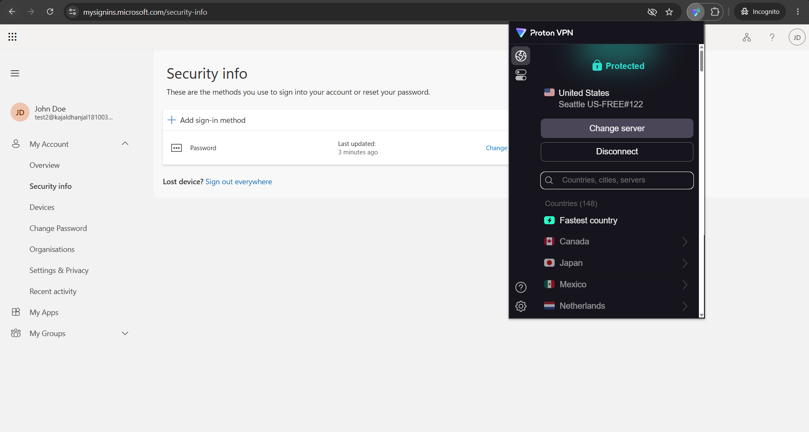
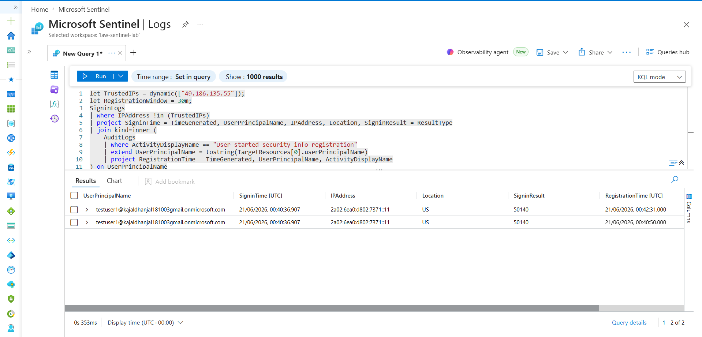
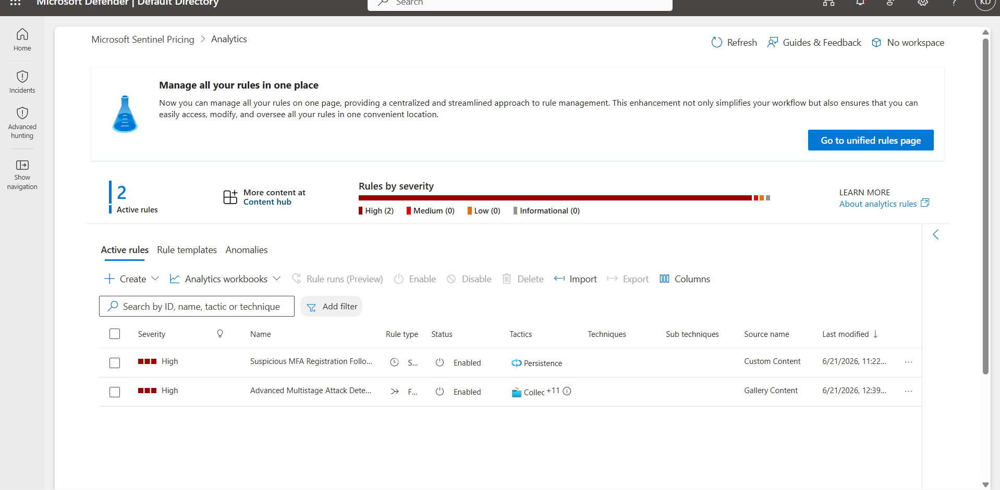
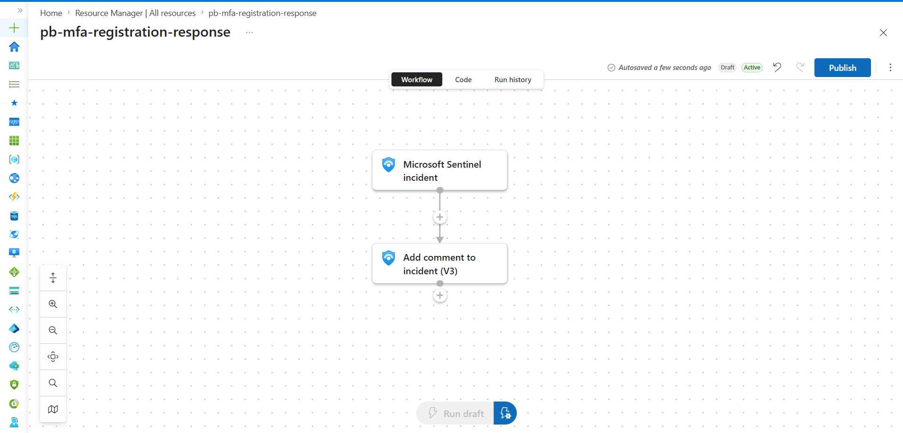
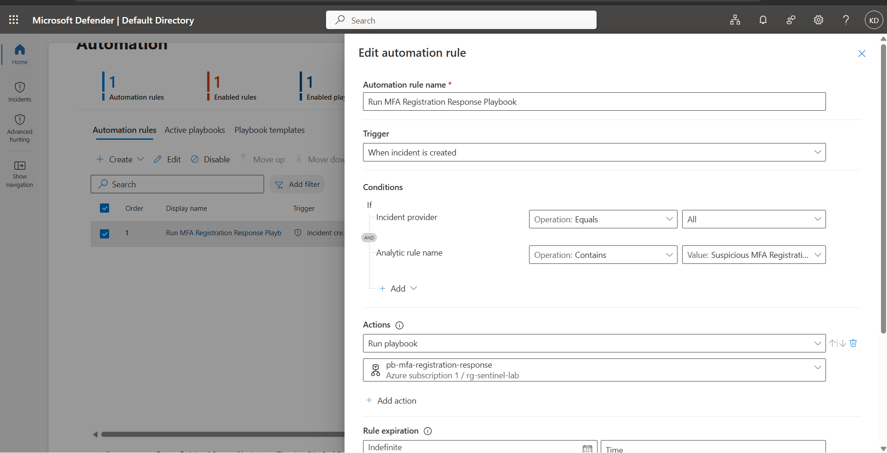
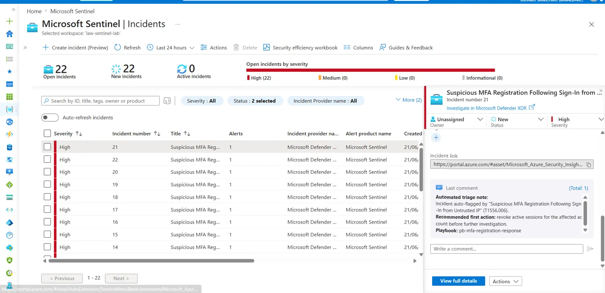

# Detection 5 — Suspicious MFA Registration Following Sign-In from Untrusted IP

**MITRE ATT&CK:** [T1556.006 — Modify Authentication Process: Multi-Factor Authentication](https://attack.mitre.org/techniques/T1556/006/)
**Tactic:** Persistence
**Data source:** Microsoft Entra ID — `SignInLogs` + `AuditLogs`
**Severity:** High

## The threat

Once an attacker has a foothold on a credential — phished, leaked, or password-sprayed — registering their *own* MFA method is one of the cleanest ways to keep access. The victim can reset their password and the attacker is still in, because their authenticator app or phone number is now a valid second factor on the account. This is exactly the behavior T1556.006 describes, and it's a step that's easy to miss because "user registered a new MFA method" looks completely normal in isolation — people change phones, lose authenticator apps, and re-register all the time.

The signal isn't the registration itself. It's the registration happening shortly after a sign-in that doesn't look like the account owner.

## The plan vs. the constraint

The clean way to build this is on top of Entra ID Protection (P2): use the sign-in risk score directly, correlate a risky sign-in with a subsequent security-info registration, done.

This lab runs in a personal Azure free tenant — Global Admin on my own tenant, since my university tenant blocks Entra diagnostic settings entirely (a separate problem this lab exists to work around). The Identity Protection P2 trial would not activate; Try/Buy stayed greyed out with no path to a workaround. No risk score, no risk-based Conditional Access, none of it.

Rather than treat that as a blocker, I built **Variant B**: a heuristic that approximates the risk signal using something every tenant has for free — a hardcoded "trusted IP" exclusion list checked against `SignInLogs.IPAddress`. Anything outside that list is treated as untrusted. It's a coarser signal than a real risk score (no device, location-velocity, or threat-intel scoring behind it), and I'm documenting that tradeoff explicitly rather than pretending it's equivalent — but it's a real, working substitute that doesn't depend on a license I don't have.

## Architecture

```
Entra ID (AuditLogs + SignInLogs)
        │  Diagnostic settings
        ▼
Log Analytics Workspace (law-sentinel-lab) ──► Microsoft Sentinel
                                                      │
                                    Scheduled Analytics Rule (KQL)
                                                      │
                                                  Incident
                                                      │
                                    Automation Rule → Logic App
                                                      │
                                       Auto-comment on incident
```

- **Workspace:** `law-sentinel-lab` (RG `rg-sentinel-lab`, Australia East)
- **Ingestion:** Entra ID diagnostic settings → AuditLogs + SignInLogs → Log Analytics
- **Detection:** Scheduled KQL analytics rule, High severity
- **Response:** Logic App playbook triggered automatically on incident creation

## Detection logic

The query correlates two events for the same user within a 30-minute window:

1. A sign-in from an IP address **not** on the trusted-IP allowlist
2. An `AuditLogs` entry showing `ActivityDisplayName == "User started security info registration"`

```kql
let TrustedIPs = dynamic(["<office/home IP 1>", "<office/home IP 2>"]); // hardcoded — see note below
let UntrustedSignIns = SigninLogs
| where IPAddress !in (TrustedIPs)
| where ResultType == 0 // successful sign-ins only
| project SignInTime = TimeGenerated, UserPrincipalName, IPAddress, Location;
let MFARegistrations = AuditLogs
| where ActivityDisplayName == "User started security info registration"
| extend UserPrincipalName = tostring(InitiatedBy.user.userPrincipalName)
| project RegTime = TimeGenerated, UserPrincipalName;
UntrustedSignIns
| join kind=inner MFARegistrations on UserPrincipalName
| where RegTime between (SignInTime .. (SignInTime + 30m))
| summarize arg_min(SignInTime, *) by UserPrincipalName, IPAddress // dedup within the lookback window
| project SignInTime, RegTime, UserPrincipalName, IPAddress, Location
```

> **Note on the trusted-IP list:** This was meant to live in a Sentinel watchlist for easy maintenance, but the watchlist creation UI in Defender XDR was broken at the time of building this (upload step silently failed). Hardcoding the list as a `dynamic()` array is a documented workaround, not the intended end state — a production version should externalize this.

## Simulating the attack

1. **Baseline:** signed in normally from my real AU IP, establishing what "the account owner" looks like in `SignInLogs`.
2. **Attacker simulation:** connected via Proton VPN (Seattle, US exit node), signed in again from that untrusted IP.
3. **Persistence step:** from that same VPN session, registered a new MFA method on the account — the actual T1556.006 action.

**The untrusted-IP sign-in, correlated with the registration event in real telemetry:**



**KQL query and deduped correlation result:**



## The analytics rule

- **Name:** Suspicious MFA Registration Following Sign-In from Untrusted IP
- **Severity:** High
- **MITRE mapping:** T1556.006 / Persistence
- **Entity mapping:** Account → `UserPrincipalName`, IP → `IPAddress`

**Analytics rule configuration — severity, MITRE mapping, entity mapping:**



## Closing the loop: automated response

Every prior detection in this lab stopped at "incident created." This one doesn't.

An Azure Logic App (`pb-mfa-registration-response`, Consumption tier) is wired to a Sentinel automation rule on **"When incident is created"** (scoped to this analytics rule). It calls **Add comment to incident (V3)** and posts an automated triage note recommending the first containment step — revoking active sessions on the affected account before further investigation — referencing the IR playbook for this detection.

I originally planned to have the playbook *write to a watchlist* (e.g., auto-adding the flagged IP to a temporary block list), but the same Defender XDR watchlist bug that broke the trusted-IP list also made watchlist writes unreliable from Logic Apps. I deliberately scoped the automation down to "add comment to incident" — a smaller, reliable action — rather than ship something flaky. Documenting that tradeoff felt more valuable than forcing a fragile demo.

**Logic App workflow — trigger → comment action:**



**Automation rule wiring the playbook to incident creation:**



**The result — incident raised with the automated triage comment already attached:**



## What I'd tune next

- **Cross-run deduplication.** The current `summarize` dedups *within* a single query's lookback window, but if the same sign-in/registration pair is still inside the lookback window across multiple scheduled runs, it can raise more than one incident for the same real event. A production version would track already-alerted event pairs (e.g., via incident custom details or a state table) to dedup across runs, not just within one.
- **Externalize the trusted-IP list** to a proper watchlist once the UI issue is resolved, instead of a hardcoded array.
- **Layer in real risk scoring** if/when P2 is available — Variant B is a reasonable substitute, not a replacement for an actual risk engine.

## IR playbook

Full incident response runbook for this detection (solo-analyst framing, revoke-sessions-first containment) is in [`docs/ir-playbook-mfa-registration.md`](../docs/ir-playbook-mfa-registration.md).
